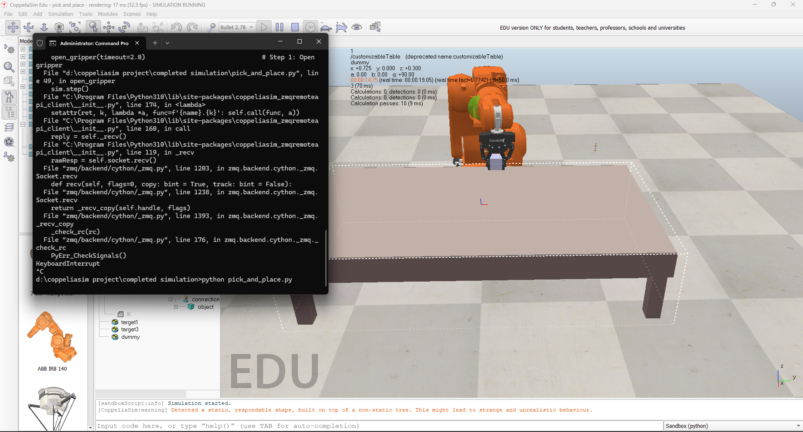

# 🤖 PICK-AND-PLACE – CoppeliaSim + Python Remote API

Pick-and-Place simulation using **ABB IRB140 robot** in **CoppeliaSim**, controlled via Python **ZMQ Remote API**.  
Includes the simulation scene (`.ttt`) and Python script (`.py`) for smooth object manipulation with gripper control.

---

## 📂 Repository Contents
- `pick and place.ttt` → CoppeliaSim scene file containing the IRB140 robot, gripper, object, and targets.
- `pick_and_place.py` → Python script implementing the pick-and-place sequence:
  - Open gripper
  - Move above the object
  - Grip the object
  - Lift smoothly
  - Move to placement target
  - Release gripper

---

## 🚀 Features
- Smooth motion interpolation for robot movements
- Gripper control (open, close, hold, release)
- Object parenting/unparenting for realistic grasp
- Step-based simulation control via Remote API
- Customizable targets for flexible pick-and-place tasks

---

## ⚙️ Requirements
- **CoppeliaSim Edu / Pro** (tested with latest EDU)
- **Python 3.8+**
- **Dependencies**:
  ```bash
  pip install coppeliasim-zmqremoteapi-client
  ````

## ▶️ How to Simulate

 1. Open the Scene in CoppeliaSim 
   - Launch CoppeliaSim 
   - Open the file: `pick and place.ttt`

 2. Ensure Remote API is Enabled 
   - In CoppeliaSim, the ZMQ Remote API is enabled by default in recent versions  
   - Keep the simulation stopped — the Python script will control starting and stepping the sim

 3. Run the Python Script
   - Open a terminal in your project folder  
   - Execute:  
     ```bash
     python pick_and_place.py
     ```

 4. Stop Simulation (optional) 
   - Once finished, the script will stop sending steps  
   - You can manually stop the simulation in CoppeliaSim if needed

## 📸 Demo

Here’s the IRB140 robot performing the pick-and-place task in CoppeliaSim:
  


📜 License

This project is open-source under the MIT License.


---

